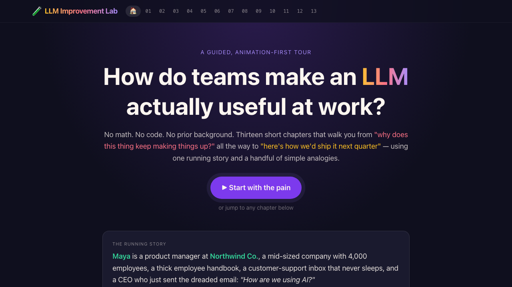
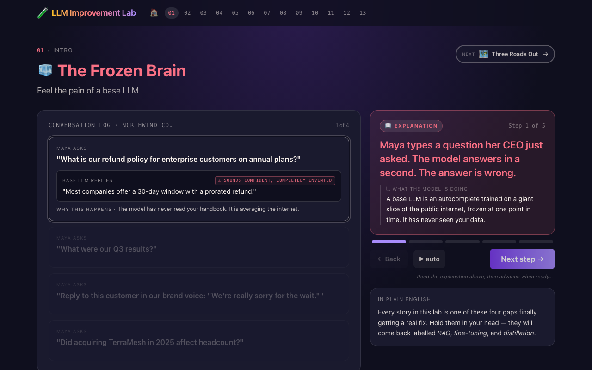
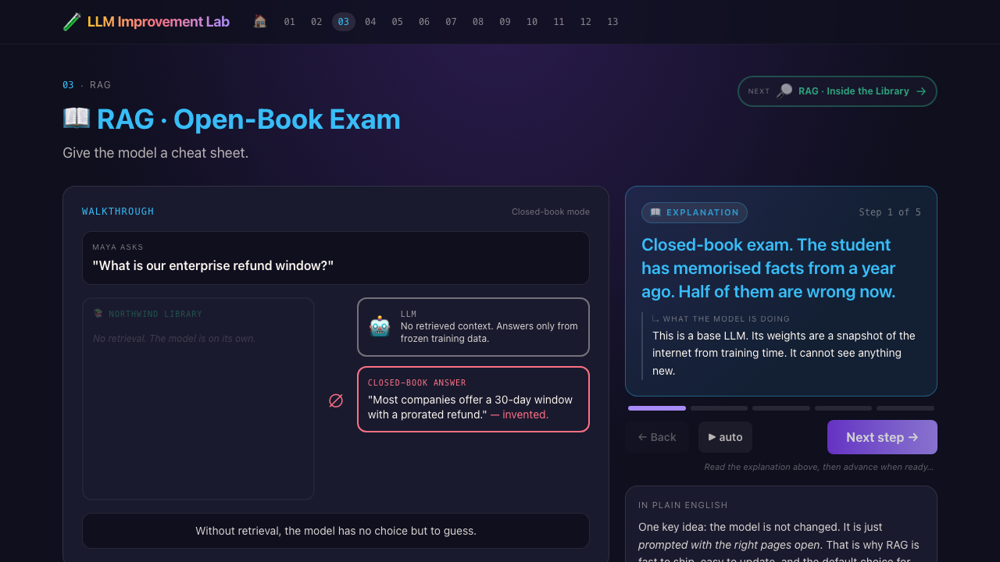
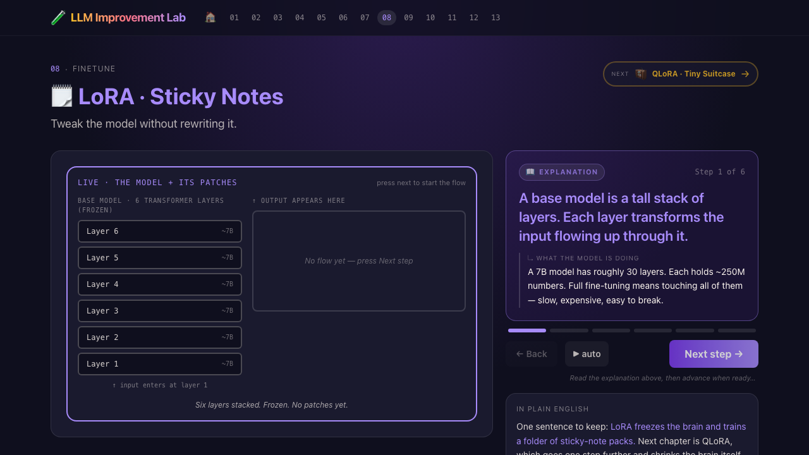
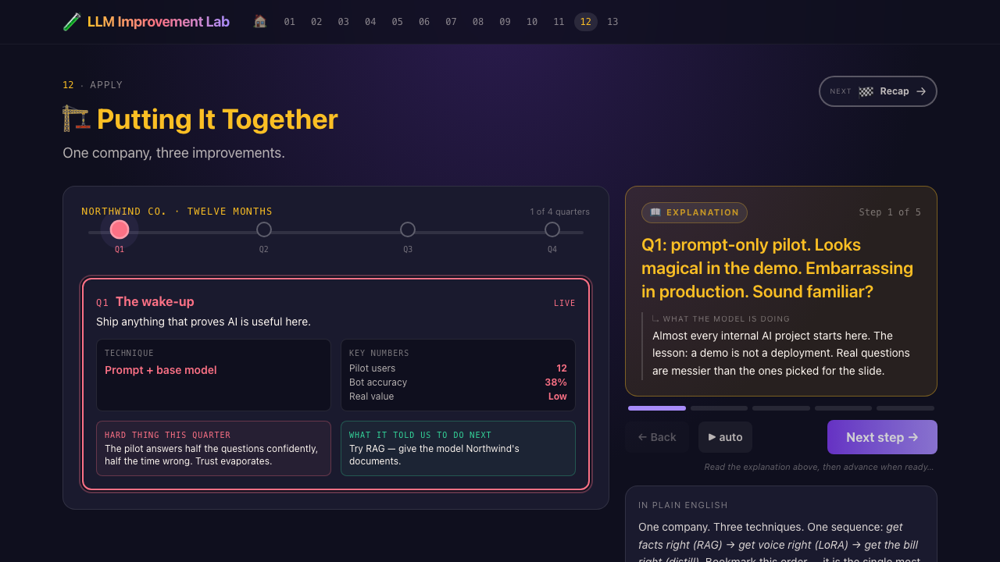

<div align="center">

# LLM Improvement Lab

### How do teams make a language model actually useful at work?

**No math. No code. No prior background.** Thirteen short, animation-first chapters that walk a non-technical learner from *"why does this thing keep making things up?"* all the way to *"here is how we would ship it next quarter"* — using one running story and a handful of simple analogies.

**▶ [Try it live](https://lionellau.github.io/llm-improvement-lab/)**

</div>

---

## Why I built this

I have spent more than a decade in data and AI, mostly helping teams turn promising prototypes into things that actually run in production. Over the last two years the same conversation keeps coming back at me, in different rooms, with different titles.

> *"The demo was magical. Our pilot answers half the questions confidently and is wrong half the time. We are losing trust. What do we do?"*

If that line stings, this lab is for you.

If it does not, this lab is also for you, in a different way. I want to be honest. There are plenty of teams using LLMs today who do not feel this pain at all. Marketers drafting first-pass copy. Engineers asking ChatGPT to remind them how a regex works. Students summarising a textbook. In those flows the model is a brilliant junior colleague and the cost of a wrong answer is tiny. You do not need RAG, LoRA, or distillation to be useful there. A good prompt and a careful human reviewer is the whole stack. That is great, keep going.

This lab is aimed at the other half of the room. The PMs and engineers and executives who tried to point a base model at company data, or at customer support, or at internal Q&A, and watched the thing confidently invent answers about a refund policy it has never read. The teams who tried to fine-tune their way out of a retrieval problem and burned a quarter. The exec who keeps hearing *"RAG", "LoRA", "distillation"* in roadmap meetings and wants to know which one fixes which pain, without sitting through a paper.

I built this for them. It is the explainer I wish I could hand to a smart colleague who has never written a line of ML code, and have them walk out twenty minutes later actually understanding what each technique does, what it does not do, and roughly when to reach for it.

I am not selling anything here. I run a small series of these explainer labs as a side project, because the same questions kept coming up in the same shapes, and writing them down once felt better than answering them sixty times. If it helps you ship something useful, that is the whole win.

— **Lionel Lau**, senior data and AI practitioner



## What you'll learn

| #  | Chapter                       | One-line                                                                        |
| -- | ----------------------------- | ------------------------------------------------------------------------------- |
| 01 | The Frozen Brain              | Why base LLMs hallucinate, go stale, and don't know your company.               |
| 02 | Three Roads Out               | RAG vs fine-tuning vs distillation — three independent approaches, on one map.  |
| 03 | RAG · Open-Book Exam          | Retrieval-augmented generation, explained like an open-book test.               |
| 04 | RAG · Inside the Library      | Embeddings + vector search, walked through one stage at a time.                 |
| 05 | RAG · Done Right              | A real win story: an HR policy assistant that actually quotes the handbook.     |
| 06 | RAG · Gone Wrong              | The four classic RAG failure modes and how to spot each in production.          |
| 07 | Fine-tune or Retrieve?        | A decision tree, walked with four real examples.                                |
| 08 | LoRA · Sticky Notes           | A single animated model stack: data flows up, patches nudge it, output changes. |
| 09 | QLoRA · Tiny Suitcase         | Why quantization made fine-tuning a frontier model affordable.                  |
| 10 | Teacher → Student             | Knowledge distillation, demystified.                                            |
| 11 | Distillation in the Wild      | When the bill tipped: a $42k → $3k support bot, end to end.                     |
| 12 | Putting It Together           | One twelve-month plan: Prompt → RAG → LoRA → Distill, in that order, on purpose.|
| 13 | Recap                         | Thirteen ideas, one printable page.                                             |

## A peek inside

<table>
  <tr>
    <td></td>
    <td></td>
  </tr>
  <tr>
    <td></td>
    <td></td>
  </tr>
</table>

## How it's built

- **Vite + React 19 + TypeScript** (strict mode).
- **Tailwind CSS v4** via `@tailwindcss/vite`.
- **HashRouter** so deep links work on GitHub Pages without a server.
- **No backend. No analytics. No telemetry. No tracking.** Everything runs in your browser, every chapter is reachable without a single network round-trip after the first page load.
- Visualisations are hand-drawn SVG and DOM. No 3D engine. The lessons here are about flow, comparison, and cause-and-effect — those read more clearly in 2D, and the bundle stays small.

### Security

Static, client-side site. Strict CSP (`default-src 'self'`, `frame-ancestors 'none'`), HSTS, no inline scripts in production, no outbound `connect-src`. Details in [`SECURITY.md`](SECURITY.md). I take this seriously: an educational tool that quietly phones home would defeat the point.

## Run it locally

```sh
# Node 20 recommended
npm install
npm run dev          # http://localhost:5173
npm run build        # production bundle in dist/
npm run preview      # serve dist/ at http://localhost:4173
```

## For fellow mentors, PMs, and engineers

Every chapter is self-contained and deep-linkable. Feel free to jump straight to whatever your audience needs and skip the rest:

- For decision-makers wondering *"do we need to fine-tune?"* → start at [Three Roads Out](#) and [Fine-tune or Retrieve?](#).
- For engineers new to RAG → [RAG · Open-Book Exam](#) and [RAG · Inside the Library](#).
- For anyone debugging a misbehaving RAG bot → [RAG · Gone Wrong](#).
- For anyone tempted to fine-tune → [LoRA · Sticky Notes](#) and [QLoRA · Tiny Suitcase](#) first.
- For anyone paying a giant API bill → [Teacher → Student](#) and [Distillation in the Wild](#).
- For an end-to-end story for an exec presentation → [Putting It Together](#).

The content is MIT-licensed. Remix and adapt freely. If you adapt it for an internal session at your company, I would love to hear how it landed.

## Roadmap

- [ ] Optional Mermaid export of the canonical sequence diagram.
- [ ] A printable one-page PDF of the Recap chapter.
- [ ] One more chapter on evaluation: how to actually grade an LLM system.
- [ ] More mobile polish — particularly for the appended-stage chapters.

## About the author

**Lionel Lau** — senior data and AI practitioner. I have spent the last decade building and shipping data systems in industry, and the last couple of years specifically helping teams figure out where LLMs fit (and where they really don't). This is the third in a small series of "explainer labs" I am publishing for curious humans:

- **[llm-explain-lab](https://github.com/lionellau/llm-explain-lab)** — how an LLM actually works (tokens → attention → next-token prediction).
- **[agent-explain-lab](https://github.com/lionellau/agent-explain-lab)** — how an AI agent loops, plans, and uses tools.
- **llm-improvement-lab** — this one, on making the model useful at work.

If a chapter helped, or a chapter confused you, please open an issue. The whole point of writing these down is to make them better over time.

## License

[MIT](LICENSE). Adapt, remix, teach with it. Attribution is welcome but not required.

## Credits

Built with [Vite](https://vitejs.dev), [React](https://react.dev), [Tailwind CSS](https://tailwindcss.com), and [React Router](https://reactrouter.com). The teaching style is influenced by Bret Victor's *Explorable Explanations*, Jay Alammar's illustrated transformer posts, and many patient colleagues who kept asking *"…but what is it actually doing?"* until I learned to answer in pictures.
